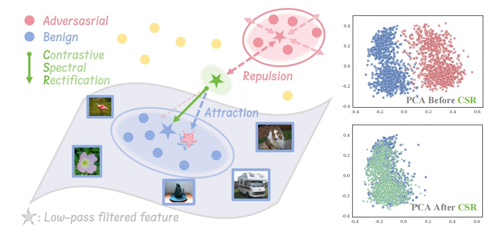
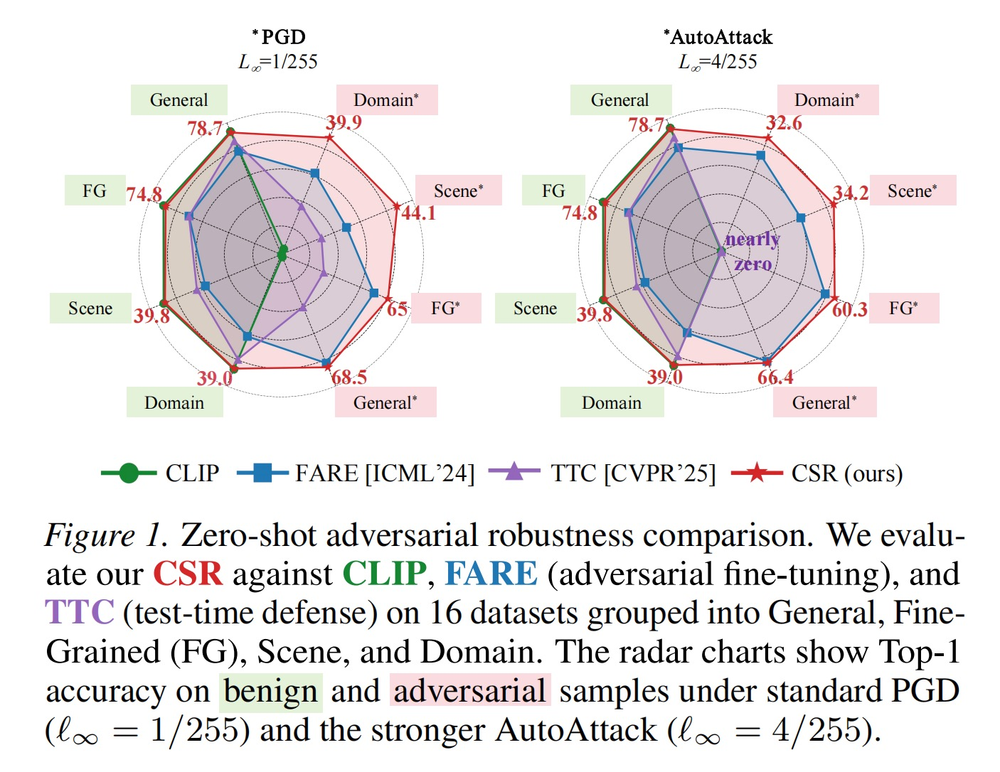
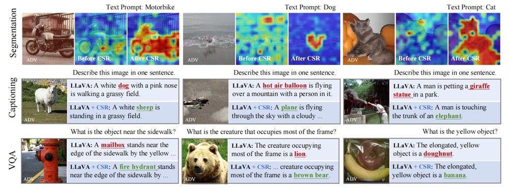

# Contrastive Spectral Rectification (CSR): Test-Time Defense towards Zero-shot Adversarial Robustness of CLIP

<a href="https://arxiv.org/abs/2601.19210"></a>
[](https://opensource.org/licenses/MIT)
[](https://www.python.org/downloads/release/python-3100/)

Official implementation of the paper "*Contrastive Spectral Rectification: Test-Time Defense towards Zero-shot Adversarial Robustness of CLIP*".

## Abstract

Vision-language models (VLMs) such as CLIP have demonstrated remarkable zero-shot generalization, yet remain highly vulnerable to adversarial examples (AEs). While test-time defenses are promising, existing methods fail to provide sufficient robustness against strong attacks and are often hampered by high inference latency and task-specific applicability. To address these limitations, we start by investigating the intrinsic properties of AEs, which reveals that AEs exhibit severe feature inconsistency under progressive frequency attenuation. We further attribute this to the model's inherent spectral bias. Leveraging this insight, we propose an efficient test-time defense named Contrastive Spectral Rectification (CSR). CSR optimizes a rectification perturbation to realign the input with the natural manifold under a spectral-guided contrastive objective, which is applied input-adaptively. Extensive experiments across 16 classification benchmarks demonstrate that CSR outperforms the SOTA by an average of 18.1% against strong AutoAttack with modest inference overhead. Furthermore, CSR exhibits broad applicability across diverse visual tasks.

## Method



**Mechanism of Contrastive Spectral Rectification (CSR).** Leveraging a spectral contrastive strategy, CSR exerts repulsion from the original adversarial feature (solid red star) within the adversarial subspace, while inducing attraction toward the low-pass filtered feature (dashed red star)—an approximation on the benign manifold. This synergy steers the optimization toward the ground-truth feature (solid blue star), effectively rectifying the feature space as corroborated by the PCA visualization (right) on 300 images.

## Requirements

```bash
pip install transformers torch torchvision
```

## Quick Start

Using CSR is as simple as using the native Transformers CLIP—just wrap your model:

```python
from CSR import RobustCLIP
from transformers import CLIPProcessor
from PIL import Image

# 1. Initialize (same as CLIP, with defense enabled automatically)
model = RobustCLIP("openai/clip-vit-base-patch32")
processor = CLIPProcessor.from_pretrained("openai/clip-vit-base-patch32")

# 2. Load image and prepare inputs
image = Image.open("image.jpg")
# Note: set do_normalize=False, CSR handles normalization internally
inputs = processor(images=image, text=["a photo of a cat", "a photo of a dog"], 
                   return_tensors="pt", do_normalize=False)

# 3. Forward pass (automatic defense applied)
outputs = model(**inputs)
logits_per_image = outputs.logits_per_image
probs = logits_per_image.softmax(dim=1)

print(f"Predictions: {probs}")
```

### Optional: Custom Defense Configuration

```python
config = {
    "FILTER_TYPE": "gaussian",    # or "butterworth", "ideal"
    "LPF_RADIUS": 40,             # low-pass filter radius
    "DETECT_THRESH": 0.85,        # adversarial detection threshold
    "PURIFY_STEPS": 3,            # PGD purification steps
    "PURIFY_EPS": 4/255,          # purification epsilon
    "PURIFY_ALPHA": 2/255,        # PGD step size
}

model = RobustCLIP("openai/clip-vit-base-patch32", config=config)
```

## Results



CSR outperforms the SOTA by an average of 18.1% against strong AutoAttack with modest inference overhead across 16 classification benchmarks.



CSR also demonstrates strong performance on other visual tasks including semantic segmentation, image captioning, and VQA.

## Citation

```bibtex
@article{nie2026contrastive,
  title={Contrastive Spectral Rectification: Test-Time Defense towards Zero-shot Adversarial Robustness of CLIP},
  author={Nie, Sen and Zhang, Jie and Wang, Zhuo and Shan, Shiguang and Chen, Xilin},
  journal={arXiv preprint arXiv:2601.19210},
  year={2026}
}
```
